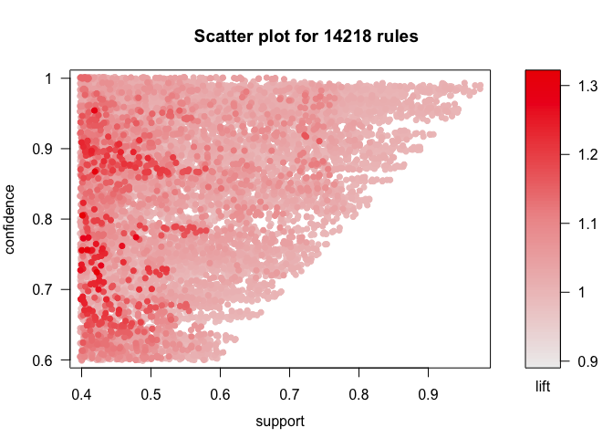
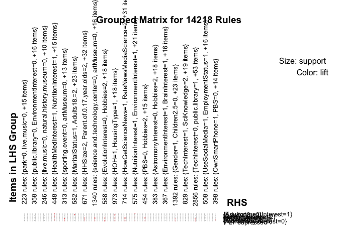

Science, Political Views, and Demographics, Oh My!
================
Caitlin Pinkard

Market basket analysis is generally applied to just that - baskets, and specificially grocery baskets. However, I've always been interested in other applications to association rule mining. In this study, I've condensed survey results from the 2017 Pew Research Center Science and News Survey in an effort to find meaningful associations between both respondents' habits and interests. The survey includes measures of political affiliation, interest in various scientific issues, as well as pertinent demographic data, such as household size, income, and the ethnicity of the survey taker.

By looking at this data and the association rules it produces, I hope to gather insights into various aspects of personality that may correlate to interests, actions, and even affiliations.

Potential research questions include: does political party allegiance have any correlation to a person's interest in certain scientific issues and does someone's role in the household impact how they get their news?

Source: 2017 Pew Research Center Science and News Survey (<http://www.pewinternet.org/dataset/2017-pew-research-center-science-and-news-survey/>)

``` r
setwd("~/Desktop/Data Mining/Blog3")

data <- read.csv("survey.csv")

#changing everything to factors
set.seed(1234)
data <- data[sample(1:nrow(data),300),c(3:33,37:65)]
for(i in 1:ncol(data)){
  data[,i] <- as.factor(data[,i])
}

library(arules)
```

    ## Warning: package 'arules' was built under R version 3.4.4

    ## Loading required package: Matrix

    ## 
    ## Attaching package: 'arules'

    ## The following objects are masked from 'package:base':
    ## 
    ##     abbreviate, write

``` r
responses <- as(data, "transactions")
```

Initially, I tried generating association rules for all of the over 4,000 responses contained in this dataset. However, the sheer size of the data paired with the seemingly endless possibilities for rule combinations caused R to crazy. So, I instead selected a random sample of 300 responses and proceeded with the analysis.

As a final data preparation step, I transformed all of the survey answers to factor variables, so that R and the arules package knew how to handle them. Finally, I transformed the dataset into the transactions type so that each response will be treated like a grocery basket. Again, this is necessary so that the arules functions will know how to manipulate the data.

NOTE: I originally included variables to indicate whether or not respondents followed ABC News, CBS News, and NBC News. However, I've now removed these because they dominated the association rules shown below and flushed out any other potentially interesting insights.

``` r
sort(itemFrequency(responses), decreasing = TRUE)[1:20]
```

    ##                           IJR=0                    BizInsider=0 
    ##                       0.9866667                       0.9833333 
    ##                           Vox=0                       LATimes=0 
    ##                       0.9766667                       0.9566667 
    ##                      Language=1                   Children0.1=0 
    ##                       0.9566667                       0.9533333 
    ##                      Politico=0 lecture.or.talk.about.science=0 
    ##                       0.9433333                       0.9200000 
    ##                 AltMethodsSci=2                   Children2.5=0 
    ##                       0.9000000                       0.9000000 
    ##                  Children6.12=0                 Children13.17=0 
    ##                       0.8766667                       0.8766667 
    ##        natural.history.museum=0                           HOH=1 
    ##                       0.8533333                       0.8300000 
    ##                       Hobbies=2 science.and.technology.center=0 
    ##                       0.8233333                       0.8066667 
    ##      Parent.of.0.17.year.olds=2                 OwnSmartPhone=1 
    ##                       0.7866667                       0.7633333 
    ##                     artMuseum=0             HealthMedInterest=1 
    ##                       0.7500000                       0.7400000

### Response Frequency

Item (or, in our case, response) frequency shows us the most frequently indicated answers to the survey across all respondents. About 98% of survey respondents answered that they do NOT get their news from either Independent Journal Review (IJR), Business Insider, or Vox. Almost 95% of respondents do not have a child under a year old and about 79% do not even have children under the age of 17. Around 76% of respondents indicat owning a smartphone.

More to the crux of this investigation, 90% of survey takers claim that they do NOT "regularly get science news from sources that provide alternative perspectives to conventional science or medical research." It will be interesting to see if this habit relates at all to political affilation when we inspect the rules created below.

``` r
response_rules <- apriori(responses, parameter = list(sup = 0.4, conf = 0.6, target="rules", minlen=2, maxlen=3))
```

    ## Apriori
    ## 
    ## Parameter specification:
    ##  confidence minval smax arem  aval originalSupport maxtime support minlen
    ##         0.6    0.1    1 none FALSE            TRUE       5     0.4      2
    ##  maxlen target   ext
    ##       3  rules FALSE
    ## 
    ## Algorithmic control:
    ##  filter tree heap memopt load sort verbose
    ##     0.1 TRUE TRUE  FALSE TRUE    2    TRUE
    ## 
    ## Absolute minimum support count: 120 
    ## 
    ## set item appearances ...[0 item(s)] done [0.00s].
    ## set transactions ...[310 item(s), 300 transaction(s)] done [0.00s].
    ## sorting and recoding items ... [57 item(s)] done [0.00s].
    ## creating transaction tree ... done [0.00s].
    ## checking subsets of size 1 2 3

    ## Warning in apriori(responses, parameter = list(sup = 0.4, conf = 0.6,
    ## target = "rules", : Mining stopped (maxlen reached). Only patterns up to a
    ## length of 3 returned!

    ##  done [0.00s].
    ## writing ... [14218 rule(s)] done [0.00s].
    ## creating S4 object  ... done [0.00s].

``` r
response_rules_sorted <- sort(response_rules, by="lift")[1:50]
inspect(sort(response_rules, by="lift", decreasing = TRUE)[1:10])
```

    ##      lhs                                  rhs                       support confidence     lift count
    ## [1]  {science.and.technology.center=0,                                                               
    ##       live.music=0}                    => {sporting.event=0}      0.4000000  0.8053691 1.320277   120
    ## [2]  {HealthMedInterest=1,                                                                           
    ##       NutritionInterest=1}             => {EnvironmentInterest=1} 0.4200000  0.7241379 1.316614   126
    ## [3]  {science.and.technology.center=0,                                                               
    ##       sporting.event=0}                => {live.music=0}          0.4000000  0.7547170 1.308758   120
    ## [4]  {natural.history.museum=0,                                                                      
    ##       sporting.event=0}                => {live.music=0}          0.4100000  0.7546012 1.308557   123
    ## [5]  {HealthMedInterest=1,                                                                           
    ##       EnvironmentInterest=1}           => {NutritionInterest=1}   0.4200000  0.8689655 1.303448   126
    ## [6]  {EnvironmentInterest=1,                                                                         
    ##       NutritionInterest=1}             => {HealthMedInterest=1}   0.4200000  0.9545455 1.289926   126
    ## [7]  {EvolutionInterest=0,                                                                           
    ##       Hobbies=2}                       => {AstromonyInterest=0}   0.4766667  0.7729730 1.281171   143
    ## [8]  {sporting.event=0,                                                                              
    ##       lecture.or.talk.about.science=0} => {live.music=0}          0.4300000  0.7329545 1.271019   129
    ## [9]  {live.music=0,                                                                                  
    ##       AltMethodsSci=2}                 => {sporting.event=0}      0.4000000  0.7741935 1.269170   120
    ## [10] {natural.history.museum=0,                                                                      
    ##       live.music=0}                    => {sporting.event=0}      0.4100000  0.7735849 1.268172   123

\*\*I've only output the top 10 rules to avoid cluttering this write-up.

### General Findings

Unfortunately, there are many rules that don't provide much useful information. For example, a vast majority of the right hand sides simply tell us that someone is NOT interested in something. The rule reads as follows: if a respondent is not interested in X and Y, then they probably aren't interested in Z either. You can see why this isn't super helpful.

### Interesting Findings

Many rules also follow the form of: if someone has an interest in X and Y, they are probably also interested in Z. The most common example of this is the second rule listed in the output above: {HealthMedInterest=1,NutritionInterest=1} =&gt; {EnvironmentInterest=1}. Interpretting the lift, if we know that someone is interested and topics of health/medical and nutrition, they are 1.32 times (32%) more likely to be interested in the environment than those who are not interested in nutrition, or health/medical issues. Perhaps, adults interested in one science-related issue are more inclined to be interested in scientific current events as a whole, making this association possible.

Another interesting finding, yet admittedly unrelated to the main purpose of this study, is that people who filled out the survey in English and have a steady, paying job are 20% more likely to also own a smartphone than those who took the survey in spanish or may not be currently employed.

``` r
library(arulesViz)
```

    ## Warning: package 'arulesViz' was built under R version 3.4.4

    ## Loading required package: grid

``` r
plot(response_rules)
```

    ## To reduce overplotting, jitter is added! Use jitter = 0 to prevent jitter.



``` r
plot(response_rules, method = "grouped")
```



The first visualization above shows how confidence, support, and lift relate to each other in this rule set. I chose to sort rules by lift because confidence and support only tell us about the prevalence of the indicated responses and not how one response influences (or correlates) to another. This relationship was really the purpose of this study.

The second visualization shows an abbreviated synopsis of the rules generated. Clearly, there are too many response options that clutter up the graphic. This leads into my suggestions for future work.

### Future Work

I hypothesize that a reason few interesting findings resulted from this study could be the sheer size of the data and the number of possible responses for each question. For example, the question regarding household income had 23 response options. Occupation and other work-related metrics also had many options from which respondents could choose. Perhaps combining some of these choices into larger bins (thus, decreasing the number of options) would other variables to appear in the association rules and new insights to bubble to the surface. This is definitely an avenue to expand on this analysis in the future.
